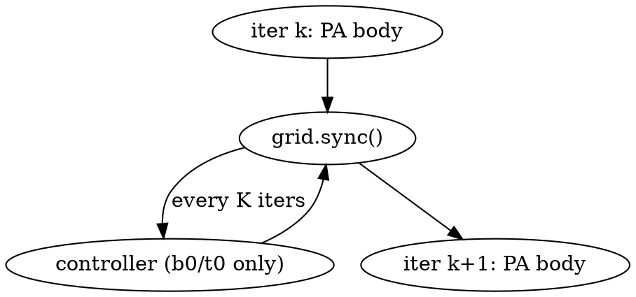

# Online θ Prediction — Design

**Status**: Spec, awaiting plan
**Branch**: `theta-predictor-online`
**Predecessor**: `2026-05-08-theta-predictor-design.md` (static v3 — deployed at commit a4ec1b6)

## Problem

The current θ predictor (v3) is **static**: a single value chosen before PA starts and held constant for all PA iterations. This misses an opportunity — the residual graph in late PA iterations is structurally different from the original (low-degree leaves removed, hubs remain), so the optimal θ for "iter 0" may not be the optimal θ for "iter 800". A dynamic θ that adapts to observed runtime workload could compress total runtime further.

## Goal

**Allow `FuzzyNumber` to monotonically increase during PA when observed signals indicate the residual graph is "thinning fast"**, while preserving the static v3 predictor's role of choosing the initial θ.

### Non-goals

- **Reactive θ DOWN-adjustment** — controller is monotone non-decreasing only.
- **Spatial / per-vertex θ** — θ remains a global scalar.
- **Replacing v3** — v3 still picks `θ_initial`; this layer adds dynamic ramp on top.
- **Multi-launch PA refactor** — controller lives on-device, no host re-launch.

## Why dynamic θ might help

User intuition (validated during brainstorming):
- PA has phases. Early iterations process "high-degree" hubs that benefit from conservative θ (color quality). Late iterations process the sparse residual where larger θ batches more work per iter without color penalty.
- Static θ is a one-size-fits-all compromise across these phases.

If true: bumping θ when the residual is sparse should reduce total iteration count → reduce kernel runtime, with little to no color cost.

## Architecture

**On-device controller**, single thread of block 0 executes at iteration boundary. PA already uses `cooperative_groups::grid.sync()` between iterations; we add a small block immediately after that sync (and before the next iteration's body).



Controller does:
1. Read current `cursor_remove` (already tracked, atomic load not needed since written before sync).
2. Compute `Δ = last_remove_size − cursor_remove` (vertices removed in last K iters).
3. Update `last_remove_size = cursor_remove`.
4. If `Δ ≥ rate_threshold · V`, set `FuzzyNumber = min(FuzzyNumber + step, cap)`.
5. Append `(iter, FuzzyNumber)` to bump-log if a bump fired.

Other threads idle on the second `grid.sync()`. After it returns, all threads see the new `FuzzyNumber` for iter k+1.

**Why on-device, not host-side**: re-launching PA between iterations would require persisting worklist + iteration_list state across launches — a major refactor. Single-thread write to `__device__ int FuzzyNumber` between two grid.syncs is race-free and adds ~5 instructions per iteration. The controller fires only every K iterations (typical K=10) so amortised cost is negligible.

## Controller logic (concrete)

State variables (added to `globals.cu`):

```cpp
__device__ int last_remove_size = 0;          // initialised to V at PA start
#define BUMP_LOG_MAX 32
__device__ int bump_count = 0;
__device__ int bump_iter [BUMP_LOG_MAX];
__device__ int bump_theta[BUMP_LOG_MAX];
```

`FuzzyNumber` already exists in `globals.cu`; starts at `θ_initial` chosen by v3 RF (`--predict`) or `-e` (manual).

Code inserted at iteration boundary in `P_SL_ELS_SDC_CTA_S`:

```cpp
// Existing iteration boundary sync
grid.sync();

// Dynamic-θ controller (compiled in only when -DDYNAMIC_THETA defined)
#ifdef DYNAMIC_THETA
if (blockIdx.x == 0 && threadIdx.x == 0) {
    if ((iter % CTRL_K) == 0 && iter >= CTRL_K) {
        int delta = last_remove_size - cursor_remove;
        if (delta < 0) delta = 0;                       // BB-style re-add safety
        last_remove_size = cursor_remove;
        if (delta >= (int)(CTRL_RATE_THRESHOLD * (float)g_nodes)) {
            int new_fz = FuzzyNumber + CTRL_STEP;
            if (new_fz > CTRL_CAP) new_fz = CTRL_CAP;
            if (new_fz > FuzzyNumber) {                  // actual change
                FuzzyNumber = new_fz;
                if (bump_count < BUMP_LOG_MAX) {
                    bump_iter [bump_count] = iter;
                    bump_theta[bump_count] = new_fz;
                    bump_count = bump_count + 1;
                }
            }
        }
    }
}
grid.sync();   // ensure all threads see new FuzzyNumber before next iter
#endif

// Existing iter advancement (unchanged)
iteration = iteration + 1 + FuzzyNumber;
```

`g_nodes` is the graph node count (added as a `__device__ int` set by setParameters before kernel launch).

## CLI surface

New flags on `CHROMA/CHROMA.cu`:

```
--dynamic-theta           Enable on-device controller (default OFF)
--dynamic-K   <int>       Sample interval, iterations between checks (default 10)
--dynamic-rate <float>    Trigger threshold = fraction of V removed per iter (default 0.005)
--dynamic-step <int>      Bump amount per trigger (default 1)
--dynamic-cap <int>       Max FuzzyNumber (default θ_initial + 5)
--dynamic-log <path>      Write trajectory JSON to <path> (default no log)
```

These are passed via `setParameters` (or new `setDynamicParameters`) into device constants `CTRL_K`, `CTRL_RATE_THRESHOLD`, `CTRL_STEP`, `CTRL_CAP`. Default: `CTRL_CAP = θ_initial + 5`.

`--dynamic-theta` and `--predict` are independent. Combinable for ablation:

| flags | behaviour |
|-------|-----------|
| (none) | static, θ from `-e` (default 0) |
| `-e N` | static, θ = N |
| `--predict` | static, θ from v3 RF |
| `--dynamic-theta` | dynamic, θ_initial = `-e N` (or 0) |
| `--predict --dynamic-theta` | dynamic, θ_initial from v3 RF, controller ramps |

## Defaults — justification

| param | default | reasoning |
|-------|--------:|-----------|
| K | 10 | Cheap (controller fires ~100× per 1000-iter PA). Larger K (50) loses responsiveness on small graphs that finish in 100-200 iters. |
| rate | 0.005 | "Removing 0.5% of V per iter" is a graph in the active-peeling phase. Mesh / road graphs at low θ fall well below this; social hubs near the end of PA also fall below. Empirical default; tunable. |
| step | 1 | Smooth ramp — never jump multiple θ levels at once. Allows per-bump correction. |
| cap | θ_initial + 5 | Safety net. v3 typically picks θ ∈ {0, 2, 3}; cap allows ramp up to {5, 7, 8} respectively. Larger caps risk runaway. |

## Output format

When `--dynamic-theta` is set, CHROMA prints to stdout:

```
θ trajectory: start=2  bumps=[(iter=120, θ=3), (iter=380, θ=4), (iter=720, θ=5)]
```

When `--dynamic-log <path>` is set, JSON written to `<path>` (one entry per CHROMA invocation; if the file exists, append):

```json
{
  "graph": "europe_osm.egr",
  "theta_initial": 2,
  "theta_final": 5,
  "ctrl_K": 10, "ctrl_rate": 0.005, "ctrl_step": 1, "ctrl_cap": 7,
  "bumps": [{"iter": 120, "theta": 3}, {"iter": 380, "theta": 4}, {"iter": 720, "theta": 5}],
  "iter_total": 850,
  "total_ms": 81.3,
  "colors": 4
}
```

Trajectory data lets paper plot θ(t) curves per graph and analyse correlation with structural features (kcore, assort, etc.).

## Failure modes

| condition | handling |
|-----------|---------|
| `delta < 0` (BB re-add inflated worklist) | clamp to 0; no bump |
| `cursor_remove > V` (corrupt) | no-op; controller is idempotent if state corrupt |
| `iter < K` (not enough samples) | skip controller |
| `bump_count == BUMP_LOG_MAX` (>32 bumps) | stop logging, controller still adjusts θ |
| Controller disabled at compile (no `-DDYNAMIC_THETA`) | zero overhead, identical to today's PA |

## Scope: which PA variants

**First cut: only `P_SL_ELS_SDC_CTA_S`** (the deployed variant). Other variants stay static. If results are positive, copy-paste-style port to `P_SL_ELS_SDC` (the algorithm 1 baseline) for ablation: shows the dynamic-θ effect is robust across kernel variants, not specific to CTA_S.

## Evaluation plan

**Three-way sweep** (script: `scripts/sweep_dynamic_theta.py`):

| label | flags |
|-------|-------|
| `static_v3` | `--predict` |
| `dyn_only` | `--dynamic-theta` |
| `static + dyn` | `--predict --dynamic-theta` |

Run on:
- **EGR holdout 8** (paper-honest)
- **EGR overlap 11** (sanity)
- **NDR sample 30** (broader holdout from the v3 training set)

Per-graph: total time, color count, θ_initial, θ_final, n_bumps. Five runs per (graph, mode), report avg/min/max.

**Aggregate metrics** (mirror existing 4-way sweep format):
- mean / geomean speedup vs `--elastic 0` baseline
- mean Δ colors vs baseline
- wins vs `static_v3` (does dyn add value?)
- "how many graphs ramp at all" vs "how many stay flat" (controller activation rate)

**Trajectory analysis** (paper figures):
- θ(t) curves for representative graphs (one per archetype: mesh, social, road, citation)
- bump-iter histogram across all graphs (do bumps cluster around specific iter fractions?)
- correlation: does `n_bumps` correlate with kcore? assortativity? V/E ratio?

**Hyperparameter sweep** (after baseline lands):
- K ∈ {5, 10, 20, 50}
- rate ∈ {0.001, 0.005, 0.01, 0.05}
- step ∈ {1, 2}
- cap ∈ {θ+3, θ+5, θ+10}

64 combos × 10 representative graphs × 5 runs × ~50 ms avg = ~3 minutes GPU time. Cheap.

## Decision criterion

After baseline sweep:

| outcome | decision |
|---------|---------|
| `static + dyn` geomean ≥ `static_v3` × 1.10 on holdout, Δcolors ≤ +0.5 | ship as default (replace `--predict` semantics) |
| `dyn_only` ≈ `static_v3` (within 5%) | dynamic alone sufficient → simpler narrative, possibly retire v3 RF |
| Neither beats static_v3 | negative result — paper still has ablation table, v3 stays canonical |

## Risks

1. **Controller overhead steals the win**. K=10 means ~5 ops × 100 fires = ~500 cycles. Compared to 1000 iterations of PA on a real graph (millions of cycles each) this is invisible. Risk mitigated.

2. **`grid.sync()` already dominates**. The added grid.sync() after the controller doubles per-iter sync cost. On graphs with very fast iters (small graphs), sync overhead may exceed any gain. Mitigation: skip the second grid.sync() and accept that all threads see the *previous* FuzzyNumber for one iter (a known-stale read of one int — harmless because next iter sees fresh value).

3. **Bumping too early on jagged worklist**. Some PA variants briefly grow the worklist (BB-style re-adds). Controller already clamps `delta < 0` → 0. Worst case: spurious bump trigger; capped by `CTRL_CAP`.

4. **No bump fires on small graphs**. Graphs that finish in <K iterations get no chance to ramp. Mitigation: dynamic mode falls back to static behaviour (no harm). Document in eval.

5. **Trajectory log race**. Only block 0 thread 0 writes to `bump_iter[]` / `bump_theta[]` / `bump_count`. No race possible. The `BUMP_LOG_MAX=32` cap is a soft limit — once reached, controller still adjusts θ but stops recording.

## Open questions for plan stage

- Whether to merge `--dynamic-theta` defaults into `setParameters` or have a separate `setDynamicParameters` kernel. (Likely: extend `setParameters` to take 5 extra args; if `dynamic_enabled=0`, the device just zeroes out CTRL_RATE_THRESHOLD which makes the controller never trigger.)
- How to handle multiple `--runs N` invocations: reset `bump_count` and `last_remove_size` between runs? Yes — add to `resetForRun()`.
- Where to put trajectory JSON: per-run or per-CHROMA-invocation? With `--runs N`, append a list of trajectories.
